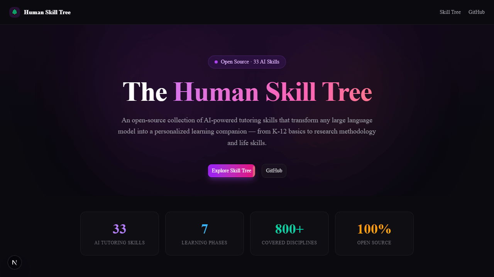
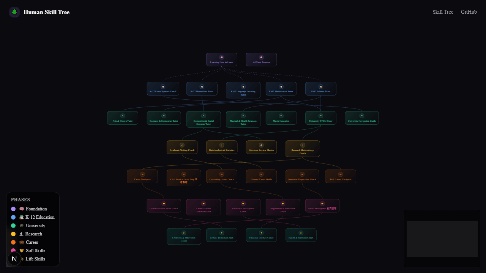
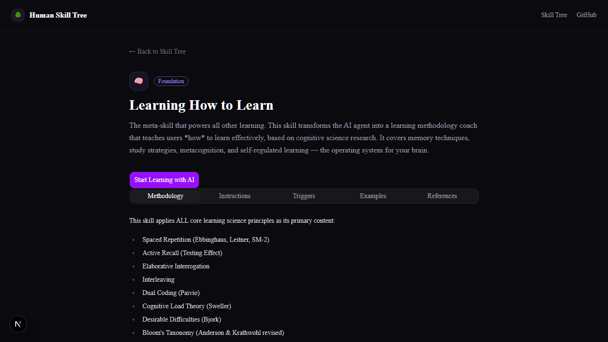
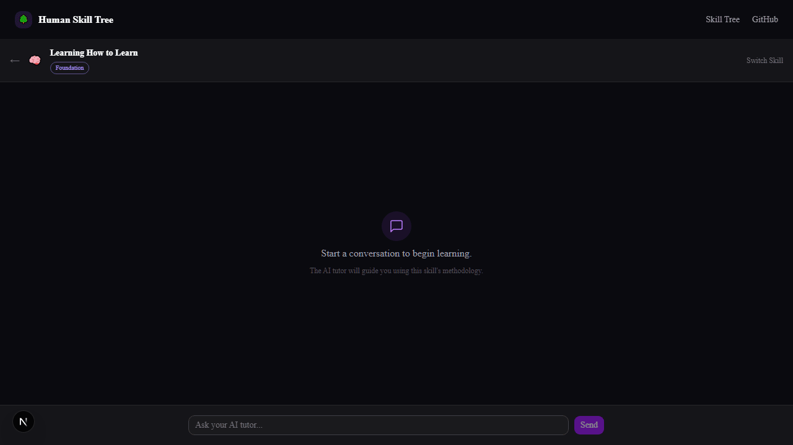

<div align="center">


# 🌳 Human Skill Tree

### The Operating System for Human Learning in the Age of AI

*AI got superpowers through Skills and MCPs. What about humans?*

**[English](#the-question) · [中文](#关于这个项目)**

[](LICENSE)
[](#-skill-tree)
[](#-skill-tree)
[](https://github.com/anthropics/skills)
[](#installation)
[](#installation)
[](#installation)
[](#installation)

</div>

---

## The Question

In 2025, AI agents gained the ability to manipulate the real world — through [Skills](https://github.com/anthropics/skills), [MCP servers](https://modelcontextprotocol.io/), and tool use. Claude can now run code, query databases, control browsers, and execute complex scientific workflows. ChatGPT can browse the web, write and run programs, analyze data. Gemini can see, hear, and interact with the physical world.

**AI got its skill tree. But what about humans?**

- A 35-year-old professional realizes their degree is becoming obsolete. How do they catch up?
- A 10-year-old will graduate into a world where AI does most knowledge work. What should they learn?
- A PhD student spends 5 years mastering a narrow field. Was that the right investment?
- A first-generation college student has no mentors. Who teaches them the unwritten rules?

These are not hypothetical questions. They are **the** questions of our time.

## The Insight

Here's what we know from the latest research:

> **AI tutoring dramatically improves learning, but only with pedagogical guardrails.** A large-scale randomized controlled trial published in *PNAS* found that GPT-4-based tutoring improved high school math performance by 48–127%. Without structured pedagogical design, students became dependent on AI and showed reduced skill acquisition. Carefully designed guardrails (providing hints instead of answers) restored learning gains.
>
> — [Bastani et al. (2025), *PNAS*, 122(26)](https://www.pnas.org/doi/10.1073/pnas.2422633122)

> **Spaced repetition and active recall are the most effective learning techniques known to science.** A meta-analysis of 242 studies with 169,000+ participants confirmed that practice testing and distributed practice outperform all other methods, including re-reading, highlighting, and summarizing.
>
> — [Dunlosky et al. (2013), *Psychological Science in the Public Interest*](https://journals.sagepub.com/doi/abs/10.1177/1529100612453266); [Donoghue & Hattie (2021)](https://doi.org/10.3389/feduc.2021.657895)

> **Algorithmically optimized spaced repetition dramatically enhances human learning.** A study published in *PNAS* analyzing data from 12 million Duolingo learners demonstrated that computationally optimized review schedules significantly outperform heuristic methods, enabling learners to memorize more material in less time.
>
> — [Tabibian et al. (2019), *PNAS*, 116(10), 3988–3993](https://www.pnas.org/doi/10.1073/pnas.1815156116)

The science is clear: **AI + cognitive science = the most powerful learning combination in human history.** The gap? AI agents have no built-in pedagogical structure. They know everything but teach nothing.

**Human Skill Tree fills that gap.**

---

## What This Is

A collection of **33 ready-to-use AI agent skills** that transform ChatGPT, Claude, Gemini, Copilot, DeepSeek, or any compatible AI into a **structured, science-backed learning companion**.

It's an **upgrade to how AI interacts with humans who want to learn**.

### 🎬 Demo

<table>
<tr>
<td align="center"><b>Landing Page</b></td>
<td align="center"><b>Skill Tree</b></td>
</tr>
<tr>
<td></td>
<td></td>
</tr>
<tr>
<td align="center"><b>Skill Detail</b></td>
<td align="center"><b>AI Chat Learning</b></td>
</tr>
<tr>
<td></td>
<td></td>
</tr>
</table>

### 💬 See the Difference

<table>
<tr>
<th>❌ Without Human Skill Tree</th>
<th>✅ With Human Skill Tree</th>
</tr>
<tr>
<td>

**You:** Teach me calculus

**AI:** Calculus is a branch of mathematics that studies continuous change. There are two main branches: differential calculus and integral calculus...

*(gives you a Wikipedia-style wall of text)*

</td>
<td>

**You:** Teach me calculus

**AI:** Before we start, let me understand where you are:
1. Can you tell me what a **function** is in your own words?
2. Have you seen the concept of **slope** before?
3. What's your goal — exam prep, or deep understanding?

*(assesses your level, then builds from YOUR foundation)*

</td>
</tr>
<tr>
<td>

**You:** My code has a bug, help me fix it

**AI:** The issue is on line 12. Change `arr[i]` to `arr[i-1]`. Here's the corrected code...

*(gives you the answer directly — you learn nothing)*

</td>
<td>

**You:** My code has a bug, help me fix it

**AI:** Let's debug this together. Before I look at the answer:
1. What did you **expect** to happen?
2. What **actually** happened?
3. Which line do you think is suspicious?

Try adding a `print(i, arr[i])` inside the loop — what do you see?

*(guides your debugging thinking — you learn the skill, not just the fix)*

</td>
</tr>
</table>

| Traditional Learning | Raw AI Chat | 🌳 Human Skill Tree |
|---|---|---|
| One-size-fits-all | No structure | Adaptive + structured |
| Passive (read/listen) | Q&A only | Active recall, spaced repetition, Socratic dialogue |
| Single subject | Knows everything, teaches nothing | Curated paths from K-12 to career |
| No social skills training | Generic advice | Culturally-aware scenario simulation |
| Takes years | Instant but forgettable | Fast AND retainable |

---

## 🔥 Learning AI in the Age of AI

The most meta question of our time: **how do you learn about AI, using AI?**

### Three Layers of AI Literacy

```
Layer 3: BUILD with AI     → Prompt engineering, fine-tuning, RAG, agents, MCP development
Layer 2: WORK with AI      → Using ChatGPT/Claude/Gemini/Copilot/DeepSeek as daily tools
Layer 1: THINK about AI    → What AI is, how it works, what it can't do, ethics, society
```

**Layer 1 — AI Fundamentals** (everyone needs this):
- What is machine learning? What are LLMs? How do they actually work?
- What can AI do well? What can't it do? Where does it hallucinate?
- Ethics: bias, privacy, job displacement, deepfakes, alignment
- Critical thinking: evaluating AI outputs, detecting errors, verifying claims

**Layer 2 — AI as a Daily Tool** (professionals & students):
- Prompt engineering: how to get better outputs from any AI
- Using AI for writing, coding, research, analysis, creativity
- AI-assisted learning: using AI as a Socratic tutor (this project!)
- Workflow integration: AI + your existing tools and processes

**Layer 3 — Building AI** (developers & researchers):
- Machine learning fundamentals: supervised, unsupervised, reinforcement
- Deep learning: neural networks, transformers, attention mechanisms
- LLM application development: APIs, function calling, RAG, fine-tuning
- Agent development: Skills, MCP servers, tool use, multi-agent systems
- AI safety and alignment research

> **The paradox**: The best way to learn AI is to use AI to learn about AI. Human Skill Tree provides the pedagogical structure that makes this self-referential loop actually work.

---

## 🌳 Skill Tree

```
🌳 Human Skill Tree
│
├── 🧠 Phase 0: Learning How to Learn (Meta-Skill)
│   └── Spaced repetition, active recall, Feynman technique,
│       memory palace, mind mapping, Bloom's taxonomy, flow state
│
├── 📚 Phase 1: K-12 Foundation
│   ├── Mathematics (arithmetic → calculus)
│   ├── Sciences (physics, chemistry, biology, earth science)
│   ├── Languages (50+ languages, classical & modern)
│   ├── Humanities (history, geography, philosophy, civics)
│   └── Exam Systems (Gaokao, SAT/AP, A-Level, IB, CSAT, JEE...)
│
├── 🎓 Phase 2: University
│   ├── University Guide (major selection, course planning, transfer)
│   ├── STEM (CS, AI/ML, engineering, math, physics, chemistry, bio)
│   ├── Humanities & Social Sciences (law, politics, sociology, media)
│   ├── Business & Economics (finance, accounting, marketing, econ)
│   ├── Medical & Health (clinical, TCM, pharmacy, psychology)
│   └── Arts & Design (fine arts, music, film, architecture)
│
├── 🔬 Phase 3: Graduate & Research
│   ├── Research Methodology (qual, quant, mixed, causal inference)
│   ├── Academic Writing (papers, thesis, grants, LaTeX)
│   ├── Literature Review (systematic search, synthesis, gap analysis)
│   └── Data Analysis & Statistics (R, Python, SPSS, Stata, spatial)
│
├── 💼 Phase 4: Career
│   ├── Career Navigator (exploration, planning, transition)
│   ├── Interview Prep (behavioral, technical, case, whiteboard)
│   ├── Civil Service 公务员 (行测, 申论, 面试, 公文写作)
│   ├── Tech Career (system design, algorithms, AI/ML, PM, DevOps)
│   ├── Finance Career (CFA, modeling, valuation, risk)
│   └── Consulting Career (case prep, MECE, slide writing)
│
├── 🤝 Phase 5: Social Intelligence
│   ├── Chinese Social Intelligence 人情世故 (面子, 关系, 饭局, 酒桌)
│   ├── Cross-Cultural Skills (Hofstede, business etiquette)
│   ├── Emotional Intelligence (EQ, empathy, self-regulation)
│   ├── Negotiation & Persuasion (BATNA, Cialdini's 6 principles)
│   └── Communication (assertive, difficult conversations, public speaking)
│
└── 🌱 Phase 6: Self-Development
    ├── Financial Literacy (budgeting, investing, tax, insurance)
    ├── Critical Thinking (logic, fallacies, media literacy)
    ├── Health & Wellness (nutrition, exercise, sleep, mental health)
    └── Creativity & Innovation (design thinking, lateral thinking)
```

> **800+ subjects** across **33 skills**, covering **15 national education systems** and **6 international curricula**.

---

## Built on Learning Science

Every skill applies cognitive science principles — not just *what* to teach, but *how human brains actually learn and remember*:

| Principle | Mechanism | Evidence |
|---|---|---|
| 🔄 **Spaced Repetition** | Fights the forgetting curve with optimal review intervals | Meta-analysis: 242 studies, 169K+ participants ([Donoghue & Hattie, 2021](https://doi.org/10.3389/feduc.2021.657895)) |
| 🧪 **Active Recall** | Retrieval practice strengthens memory 10x vs re-reading | [Roediger & Butler (2011)](https://doi.org/10.1016/j.jml.2010.12.004), *Journal of Memory and Language* |
| 🎯 **Desirable Difficulties** | Short-term struggle → long-term retention | [Bjork & Bjork (2011)](https://doi.org/10.1016/B978-0-12-385527-5.00009-4) |
| 🔀 **Interleaving** | Mixing topics builds discrimination ability | [Pan et al. (2018)](https://doi.org/10.1037/xge0000546), *J. Exp. Psych: General* |
| 🖼️ **Dual Coding** | Words + visuals = stronger encoding | [Paivio (1991)](https://doi.org/10.1037/0033-295X.98.2.148), *Psychological Review* |
| 🪞 **Socratic Method** | Questions > answers for deep understanding | [Chi et al. (2001)](https://doi.org/10.1207/s15516709cog2505_1), *Cognitive Science* |
| 🧩 **Chunking** | Group information into meaningful units | [Miller (1956)](https://doi.org/10.1037/h0043158), *Psychological Review* |
| 📊 **Bloom's Taxonomy** | 6 cognitive levels: remember → create | [Anderson & Krathwohl (2001)](https://doi.org/10.1007/978-94-007-0753-5_305) |

---

## Installation

### Quick Start

```bash
# Clone the repository
git clone https://github.com/24kchengYe/human-skill-tree.git

# Copy all skills to your agent
cp -r human-skill-tree/skills/* ~/.claude/skills/
```

### Install Individual Skills

```bash
# Meta-skill: learning methodology
cp -r human-skill-tree/skills/00-learning-how-to-learn ~/.claude/skills/

# K-12 math tutoring
cp -r human-skill-tree/skills/01-k12-mathematics ~/.claude/skills/

# Chinese social intelligence 人情世故
cp -r human-skill-tree/skills/05-social-intelligence ~/.claude/skills/
```

### Supported AI Tools

| Tool | Skill Directory | Status |
|---|---|---|
| [**Claude Code**](https://claude.ai/code) | `~/.claude/skills/` | ✅ Primary |
| [**Cursor**](https://cursor.com) | `~/.cursor/skills/` | ✅ Supported |
| [**OpenAI Codex CLI**](https://github.com/openai/codex) | `~/.codex/skills/` | ✅ Supported |
| [**Gemini CLI**](https://github.com/google-gemini/gemini-cli) | `~/.gemini/skills/` | ✅ Supported |
| [**GitHub Copilot**](https://github.com/features/copilot) | Custom config | 🔜 Planned |
| [**DeepSeek**](https://github.com/deepseek-ai) | Custom config | 🔜 Planned |

---

## Ecosystem

We build on top of existing tools. Here are the best complementary projects:

### MCP Servers

| Server | What It Does | Stars |
|---|---|---|
| [**DeepTutor**](https://github.com/HKUDS/DeepTutor) | AI personalized learning assistant (HKU) | ⭐ 9,000+ |
| [**Anki MCP**](https://github.com/ankimcp/anki-mcp-server) | Spaced repetition flashcard integration | ⭐ 154 |
| [**Canvas LMS MCP**](https://github.com/DMontgomery40/mcp-canvas-lms) | 54 tools for learning management | Moderate |
| [**Wolfram Alpha MCP**](https://github.com/cnosuke/mcp-wolfram-alpha) | Computational knowledge engine | Multiple |
| [**MandarinMCP**](https://github.com/w41ch0ng/MandarinMCP) | HSK Chinese vocabulary + spaced repetition | New |

### Agent Skills

| Skill | Install |
|---|---|
| [education-tutor](https://skills.sh/eddiebe147/claude-settings/education-tutor) | `npx skills add eddiebe147/claude-settings@education-tutor -g -y` |
| [learn-faster-kit](https://github.com/hluaguo/learn-faster-kit) | `npx skills install hluaguo/learn-faster-kit` |
| [academic-research-writer](https://skills.sh/endigo/claude-skills/academic-research-writer) | `npx skills add endigo/claude-skills@academic-research-writer -g -y` |

> See [docs/landscape.md](docs/landscape.md) for the full ecosystem survey (50+ tools).

### 🌐 Interactive Web App

Try the skills in your browser with an interactive learning experience:

**[Human Skill Tree App](https://github.com/24kchengYe/human-skill-tree-app)** — Next.js web app with:
- **Socratic Tutor System** — 6 AI tutor characters (Aria, Marcus, Lin, Euler, Feynman, Curie) with enforced Socratic teaching
- **Cross-Tutor Memory** — Tutors share context: what was taught, where you got stuck, attitude evolution
- **Social World** — Auto-generated group chat (tutors discuss you) + learning diary
- **Story Backgrounds** — 5 immersive settings (Academy, Starship, Workshop, Garden, Café)
- Interactive skill tree visualization with React Flow
- Knowledge point tracking & spaced repetition review
- Multi-language UI (English, 中文, 日本語)

---

## Education Systems Covered

### 🌍 15 National Systems

| Region | Countries |
|---|---|
| **East Asia** | 🇨🇳 China (高考), 🇯🇵 Japan (共通テスト), 🇰🇷 Korea (수능), 🇸🇬 Singapore |
| **Europe** | 🇬🇧 UK (GCSE/A-Level), 🇩🇪 Germany (Abitur), 🇫🇷 France (Bac), 🇳🇱 🇨🇭 🇫🇮 |
| **Americas** | 🇺🇸 USA (SAT/AP), 🇨🇦 Canada |
| **South Asia** | 🇮🇳 India (JEE/NEET) |
| **Middle East** | 🇮🇱 Israel (Bagrut) |
| **Oceania** | 🇦🇺 Australia (ATAR) |

### 🌐 6 International Curricula

IB · Cambridge IGCSE/A-Level · Montessori · Waldorf/Steiner · Reggio Emilia · Classical Trivium

---

## Roadmap

- [x] **Phase 1**: Project structure, 3 flagship skills, ecosystem survey
- [ ] **Phase 2**: K-12 full coverage, university STEM tutor, exam systems
- [ ] **Phase 3**: Career skills, cross-cultural, EQ, MCP integrations
- [x] **Phase 4**: Multi-language (日本語), web visualization app ([human-skill-tree-app](https://github.com/24kchengYe/human-skill-tree-app))

---

## Contributing

See [CONTRIBUTING.md](CONTRIBUTING.md) for guidelines. We welcome:

- 🆕 **New skills** — Pick any uncovered subject
- 🌍 **Translations** — Help learners worldwide
- 📊 **Research** — Learning science insights with citations
- 🔗 **Integrations** — MCP servers, flashcard tools, LMS platforms

---

## Philosophy

### Why "Skill Tree"?

In RPGs, a skill tree is a branching structure where you unlock abilities by investing points. Real life works the same way — prerequisites matter, multiple paths exist, specialization is valid, and you can always respec.

### Why Social Intelligence?

No other AI skill project covers **人情世故** — the art of navigating human relationships. Yet this is arguably the most important skill set for success in life. AI can be a safe space to practice these skills through scenario simulation.

### Why Learning Science?

Most AI tutoring is "ask a question, get an answer." This creates the **illusion of learning** — you feel like you understand, but forget within days. Our skills are designed around how memory actually works: test before tell, space it out, make it hard, connect it, apply it.

---

## Support This Project

If Human Skill Tree helps you learn anything, consider:

- ⭐ **Star** this repo — helps others discover it
- 🍕 **[Sponsor](https://github.com/sponsors/24kchengYe)** — fund continued development
- 🔀 **Fork & contribute** — help build the tree

---

## References

1. Bastani, H. et al. (2025). "Generative AI without guardrails can harm learning." *PNAS*, 122(26). [Link](https://www.pnas.org/doi/10.1073/pnas.2422633122)
2. Dunlosky, J. et al. (2013). "Improving Students' Learning With Effective Learning Techniques." *Psychological Science in the Public Interest*, 14(1), 4-58.
3. Donoghue, G.M. & Hattie, J.A.C. (2021). "A Meta-Analysis of Ten Learning Techniques." *Frontiers in Education*.
4. Pan, S.C. & Rickard, T.C. (2018). "Transfer of test-enhanced learning." *J. Experimental Psychology: General*, 147(11), 1641-1664.
5. Brown, P.C., Roediger, H.L., & McDaniel, M.A. (2014). *Make It Stick: The Science of Successful Learning*. Harvard University Press.
6. Tabibian, B. et al. (2019). "Enhancing human learning via spaced repetition optimization." *PNAS*, 116(10), 3988–3993. [Link](https://www.pnas.org/doi/10.1073/pnas.1815156116)
7. Bjork, R.A. & Bjork, E.L. (2011). "Making Things Hard on Yourself, But in a Good Way."

---

## Changelog

- **v1.4** (2026-03-10): Web App upgraded with Socratic Tutor System — 6 AI tutor characters, cross-tutor memory, social world (group chat + diary), 5 story backgrounds, 7-layer system prompt
- **v1.3** (2026-03-09): Updated to 33 skills; linked interactive web app with learning progress tracking, spaced repetition, and multi-language support
- **v1.2** (2026-03-09): Added Socratic Teaching Mode to core skill; new AI Tutor Persona skill (32 total); all skills now include Progress Tracking & Spaced Review
- **v1.1** (2026-03-08): Developed all 28 stub skills to full content; added validation script + CI; created GitHub Discussions, Release v1.0.0, 5 good-first-issues
- **v1.0** (2026-03-07): Initial release with 31 skills covering K-12 through career development

---

## License

[MIT](LICENSE) — use it, modify it, share it. Knowledge should be free.

---

<div align="center">

**Built by humans, for humans, powered by AI.**

*"The only skill tree that matters is the one you actually climb."*

</div>

---

---

<a id="关于这个项目"></a>

<div align="center">

# 🌳 人类技能树

### AI 时代的人类学习操作系统 · 人类养成记

*AI 通过 Skill 和 MCP 获得了操纵现实的能力。人类呢？*

</div>

---

## 这个时代的问题

2025 年，AI 智能体通过 Skill、MCP 和工具调用，获得了操控现实世界的能力。Claude 能运行代码、查询数据库、控制浏览器。ChatGPT 能联网搜索、写代码、分析数据。Gemini 能看、能听、能与物理世界交互。

**AI 有了自己的技能树。人类呢？**

- 一个 35 岁的职场人发现自己的学位正在过时。怎么赶上？
- 一个 2026 年出生的孩子，成年时 AI 已无处不在。该学什么？
- 一个博士生花 5 年钻研一个窄领域。这笔投资对吗？
- 一个农村来的大学生没有人脉、没有导师。谁来教他那些不成文的规则？

这些不是假设性的问题。这是**我们这个时代最核心的问题**。

## 洞察

最新研究告诉我们：

> **AI 辅导可大幅提升学习效果，但前提是有教学结构。** 发表在 *PNAS* 上的大规模随机对照试验发现：GPT-4 辅导使高中数学成绩提升 48–127%，但缺乏教学设计时学生会依赖 AI，技能习得反而下降。精心设计的教学引导（给提示而非答案）才能恢复学习效果。
>
> — [Bastani et al. (2025), *PNAS*](https://www.pnas.org/doi/10.1073/pnas.2422633122)

> **间隔重复和主动回忆是科学已知最有效的学习方法。** 一项涵盖 242 项研究、169,000+ 参与者的 Meta 分析证实：练习测试和分散练习的效果超过所有其他方法。
>
> — [Dunlosky et al. (2013)](https://journals.sagepub.com/doi/abs/10.1177/1529100612453266); [Donoghue & Hattie (2021)](https://doi.org/10.3389/feduc.2021.657895)

科学结论很清晰：**AI + 认知科学 = 人类历史上最强大的学习组合。** 问题在于，AI 智能体没有内置的教学结构。它们什么都知道，但什么都不会教。

**人类技能树填补这个缺口。**

---

## 这是什么

一套 **33 个即装即用的 AI 智能体技能**，能将 ChatGPT、Claude、Gemini、Copilot、DeepSeek 或任何兼容 AI 转化为**结构化、基于科学的学习伙伴**。

这是对 **AI 与想要学习的人类互动方式的升级**。

### 🎬 演示

<table>
<tr>
<td align="center"><b>首页</b></td>
<td align="center"><b>技能树</b></td>
</tr>
<tr>
<td></td>
<td></td>
</tr>
<tr>
<td align="center"><b>技能详情</b></td>
<td align="center"><b>AI 对话学习</b></td>
</tr>
<tr>
<td></td>
<td></td>
</tr>
</table>

### 💬 看看差别

<table>
<tr>
<th>❌ 没有人类技能树</th>
<th>✅ 有人类技能树</th>
</tr>
<tr>
<td>

**你：** 教我微积分

**AI：** 微积分是研究连续变化的数学分支。有两个主要分支：微分和积分……

*（给你一堵维基百科式的文字墙）*

</td>
<td>

**你：** 教我微积分

**AI：** 开始之前，让我了解你的基础：
1. 你能用自己的话说说什么是**函数**吗？
2. 你接触过**斜率**的概念吗？
3. 你的目标是——备考还是深入理解？

*（评估你的水平，然后从你的基础开始构建）*

</td>
</tr>
<tr>
<td>

**你：** 我的代码有 bug，帮我修

**AI：** 问题在第12行。把 `arr[i]` 改成 `arr[i-1]`。修改后的代码如下……

*（直接给答案——你什么都没学到）*

</td>
<td>

**你：** 我的代码有 bug，帮我修

**AI：** 我们一起调试。在我看答案之前：
1. 你**期望**发生什么？
2. **实际**发生了什么？
3. 你觉得哪一行有问题？

试试在循环里加一个 `print(i, arr[i])`——你看到了什么？

*（引导你的调试思维——你学到的是技能，而不仅仅是修复方案）*

</td>
</tr>
</table>

| 传统学习 | 裸聊 AI | 🌳 人类技能树 |
|---|---|---|
| 一刀切 | 无结构 | 自适应 + 结构化 |
| 被动（阅读/听讲） | 问答式 | 主动回忆、间隔重复、苏格拉底对话 |
| 单一学科 | 什么都知道，什么都不会教 | K-12 到职业的精选路径 |
| 无社交技能训练 | 通用建议 | 文化感知的场景模拟 |
| 耗时数年 | 即时但易忘 | 既快又记得住 |

---

## 🔥 在 AI 时代学习 AI

最 meta 的问题：**如何用 AI 学习 AI？**

```
第3层: 用 AI 构建     → 提示词工程、微调、RAG、Agent 开发、MCP 开发
第2层: 用 AI 工作     → 用 ChatGPT/Claude/Gemini/Copilot/DeepSeek 作为日常工具
第1层: 理解 AI        → AI 是什么、怎么工作、不能做什么、伦理、社会影响
```

**悖论**：学 AI 最好的方式就是用 AI 学 AI。人类技能树提供了让这个自指循环真正有效的教学结构。

---

## 🌳 技能树总览

```
🌳 人类技能树
│
├── 🧠 第0层：学会学习（元技能）
│   └── 间隔重复、主动回忆、费曼学习法、记忆宫殿、思维导图
│
├── 📚 第1层：K-12 基础教育
│   ├── 数学 · 自然科学 · 语言（50+语种）· 人文社科
│   └── 考试体系（高考/SAT/AP/A-Level/IB/수능/JEE…）
│
├── 🎓 第2层：本科专业
│   ├── 理工科（CS/AI/工程/数理化生）· 人文社科 · 商科经济
│   ├── 医学健康 · 艺术设计 · 选专业/转专业指南
│   └── 🔥 AI 与机器学习（从入门到 Agent 开发）
│
├── 🔬 第3层：研究生与科研
│   └── 研究方法 · 学术写作 · 文献综述 · 数据分析
│
├── 💼 第4层：职业技能
│   ├── 职业导航 · 面试准备 · 科技/金融/咨询行业
│   └── 🇨🇳 公务员（行测/申论/面试/公文写作）
│
├── 🤝 第5层：社交智慧
│   ├── 🇨🇳 中国人情世故（面子/关系/饭局/酒桌/送礼）
│   ├── 跨文化沟通 · 情商 · 谈判与说服
│   └── 沟通技巧（果敢表达/困难对话/公共演讲）
│
└── 🌱 第6层：自我发展
    └── 财商 · 批判性思维 · 健康管理 · 创造力
```

> 覆盖 **800+ 学科**，**33 技能**，**15 个国家教育体系**，**6 种国际课程**。

---

## 安装

```bash
# 克隆
git clone https://github.com/24kchengYe/human-skill-tree.git

# 全部安装
cp -r human-skill-tree/skills/* ~/.claude/skills/

# 或按需安装
cp -r human-skill-tree/skills/00-learning-how-to-learn ~/.claude/skills/   # 学会学习
cp -r human-skill-tree/skills/01-k12-mathematics ~/.claude/skills/         # K-12 数学
cp -r human-skill-tree/skills/05-social-intelligence ~/.claude/skills/     # 人情世故
```

兼容：**Claude Code** · **Cursor** · **OpenAI Codex** · **Gemini CLI**

---

## 基于学习科学

每个技能都运用认知科学原理——不仅是教**什么**，更是**人脑如何学习和记忆**：

| 原理 | 机制 | 证据 |
|------|------|------|
| 🔄 **间隔重复** | 以最优间隔对抗遗忘曲线 | Meta 分析：242 项研究，169K+ 参与者 |
| 🧪 **主动回忆** | 检索练习使记忆强度提升 10 倍 | Roediger & Butler (2011) |
| 🎯 **适度困难** | 短期挣扎 → 长期保留 | Bjork & Bjork (2011) |
| 🔀 **交叉练习** | 混合主题培养辨别能力 | Pan et al. (2018) |
| 🖼️ **双重编码** | 文字 + 视觉 = 更强编码 | Paivio (1991) |
| 🪞 **苏格拉底法** | 提问 > 给答案，深度理解 | Chi et al. (2001) |
| 🧩 **组块化** | 将信息分组为有意义的单元 | Miller (1956) |
| 📊 **布鲁姆分类** | 6 个认知层次：记忆 → 创造 | Anderson & Krathwohl (2001) |

---

## 覆盖的教育体系

### 🌍 15 个国家体系

| 地区 | 国家 |
|------|------|
| **东亚** | 🇨🇳 中国（高考）、🇯🇵 日本（共通テスト）、🇰🇷 韩国（수능）、🇸🇬 新加坡 |
| **欧洲** | 🇬🇧 英国（GCSE/A-Level）、🇩🇪 德国（Abitur）、🇫🇷 法国（Bac）、🇳🇱 🇨🇭 🇫🇮 |
| **美洲** | 🇺🇸 美国（SAT/AP）、🇨🇦 加拿大 |
| **南亚** | 🇮🇳 印度（JEE/NEET） |
| **中东** | 🇮🇱 以色列（Bagrut） |
| **大洋洲** | 🇦🇺 澳大利亚（ATAR） |

### 🌐 6 种国际课程

IB · Cambridge IGCSE/A-Level · 蒙台梭利 · 华德福 · 瑞吉欧 · 古典三艺

### 🌐 互动 Web 应用

在浏览器中体验技能树：**[Human Skill Tree App](https://github.com/24kchengYe/human-skill-tree-app)** — 苏格拉底导师系统（6位AI导师 + 跨导师记忆 + 群聊/日记社交世界） + 交互式可视化 + 知识点追踪 + 间隔复习 + 三语界面

---

## 设计理念

### 为什么叫「技能树」？

在 RPG 游戏里，技能树是通过投入点数解锁能力的分支结构。现实也一样——有前置条件、多条路径、专精是有效的，而且你随时可以重新分配。

### 为什么要做社交智慧？

没有其他 AI 技能项目覆盖**人情世故**——驾驭人际关系的艺术。然而这可以说是人生成功最重要的技能。AI 可以通过场景模拟，成为练习这些技能的安全空间。

### 为什么要基于学习科学？

大多数 AI 辅导是"问个问题，得个答案"。这制造了**学习的幻觉**——你感觉自己懂了，但几天内就忘了。我们的技能围绕记忆的真实运作方式设计：先测再教、分散复习、制造适度困难、建立联系、实际应用。

---

## 参考文献

1. Bastani, H. et al. (2025). "Generative AI without guardrails can harm learning." *PNAS*, 122(26).
2. Dunlosky, J. et al. (2013). "Improving Students' Learning With Effective Learning Techniques." *Psychological Science in the Public Interest*, 14(1), 4-58.
3. Donoghue, G.M. & Hattie, J.A.C. (2021). "A Meta-Analysis of Ten Learning Techniques." *Frontiers in Education*.
4. Tabibian, B. et al. (2019). "Enhancing human learning via spaced repetition optimization." *PNAS*, 116(10), 3988–3993.
5. Brown, P.C. et al. (2014). *Make It Stick: The Science of Successful Learning*. Harvard University Press.

---

## 参与贡献

详见 [CONTRIBUTING.md](CONTRIBUTING.md)

- 🆕 **添加新技能** — 选一个未覆盖的学科
- 🌍 **翻译** — 日本語、한국어、Español、Français…
- 📊 **研究** — 分享学习科学论文与洞察
- 🔗 **集成** — 对接 MCP、闪卡、LMS

---

## 支持项目

- ⭐ **Star** 这个仓库 — 让更多人发现它
- 🍕 **[赞助](https://github.com/sponsors/24kchengYe)** — 支持持续开发
- 🔀 **Fork & 贡献** — 一起建这棵树

---

## 更新日志

- **v1.4** (2026-03-10): Web 应用升级苏格拉底导师系统——6位AI导师角色、跨导师记忆、社交世界（群聊+日记）、5个故事背景、7层系统提示词
- **v1.3** (2026-03-09): 更新至 33 个技能；关联交互式 Web 应用（学习进度追踪、间隔复习、三语支持）
- **v1.2** (2026-03-09): 核心技能加入苏格拉底教学模式；新增 AI Tutor Persona 技能（共 32 个）；所有技能加入进度追踪与间隔复习
- **v1.1** (2026-03-08): 28 个框架技能全部开发完成；添加验证脚本 + CI；创建 GitHub Discussions、Release v1.0.0、5 个 good-first-issue
- **v1.0** (2026-03-07): 首次发布，31 个技能覆盖 K-12 到职业发展

---

## 许可证

[MIT](LICENSE) — 自由使用、修改、分享。知识应当自由。

---

<div align="center">

**由人类构建，为人类服务，AI 驱动。**

*"唯一重要的技能树，是你真正去攀爬的那棵。"*

</div>

---


[](https://star-history.com/#24kchengYe/human-skill-tree&Date)
